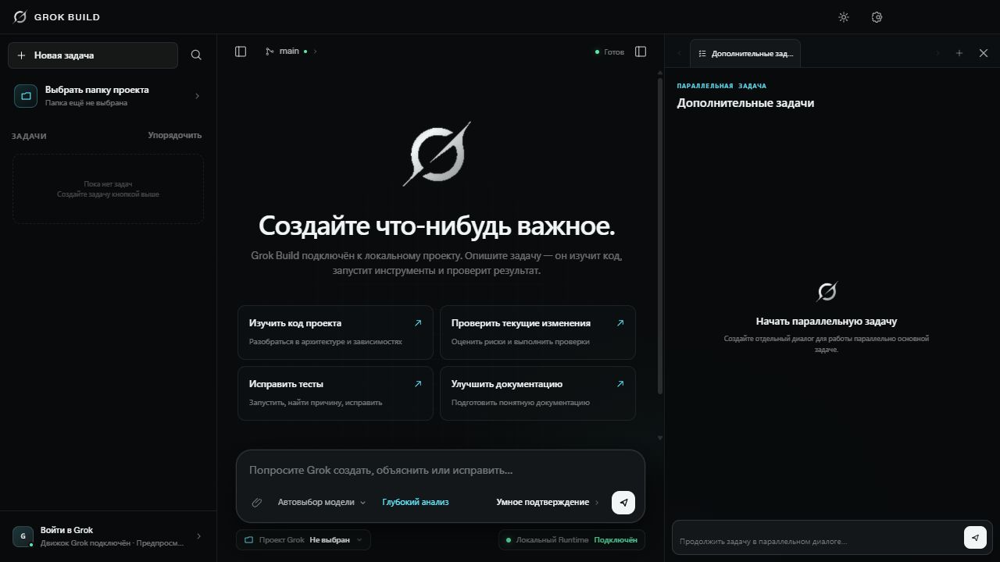
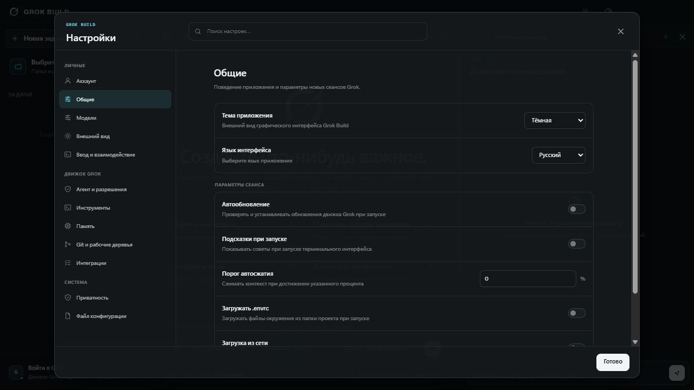
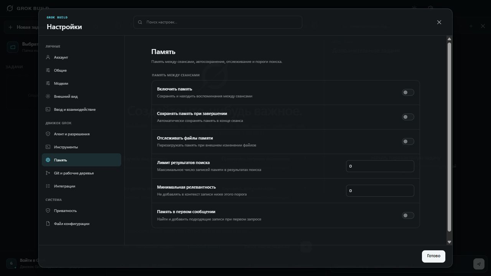
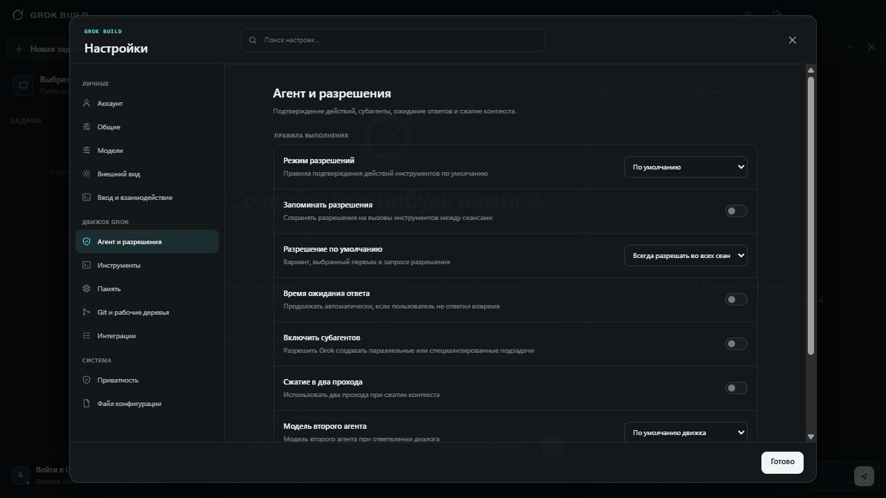

# Grok Build GUI RU

**Русская настольная оболочка для Grok Build: проекты, диалоги, инструменты, терминал, память и настройки в одном окне.**

Неофициальная русская редакция [Grok Build GUI](https://github.com/Jane-o-O-o-O/grok-build-gui), основанная на исходной версии **0.1.1**. Версия русской редакции — **0.1.1-ru.1**. Она переводит оболочку и её локальные сообщения, сохраняя механизм выполнения задач через установленный официальный Grok Runtime.

Проект сообщества не является официальным приложением xAI. Установка оболочки не предоставляет подписку, доступ к моделям или API-кредиты. Доступ настраивается отдельно в Grok Runtime либо у выбранного поставщика моделей.

[Исходный проект](https://github.com/Jane-o-O-o-O/grok-build-gui) · [Релизы](https://github.com/QueQueEpta/grok-build-gui-ru/releases) · [Сообщить об ошибке](https://github.com/QueQueEpta/grok-build-gui-ru/issues) · [Лицензия](LICENSE)

## Что переведено

Русский выбран по умолчанию. При первом запуске этой редакции существующая настройка языка однократно переводится на русский; остальные сохранённые настройки и диалоги сохраняются. Позже язык можно выбрать вручную: **Настройки → Общие**.

- Главное окно, список задач, ввод запроса и быстрые действия.
- Все страницы настроек, описания параметров, поиск и подсказки.
- 59 параметров локального движка Grok, представленных в интерфейсе.
- Команды через `/`, подписи инструментов и сообщения о выполнении.
- Память, разрешения, Git, рабочие деревья и интеграции.
- Параллельные диалоги, терминал, браузер и просмотр файлов.
- Вход, выход, обнаружение движка, уведомления и ошибки локальных компонентов.
- Подключение сторонних моделей и проверка совместимости инструментов.

В словаре этой редакции **510 строк**. Китайский язык удалён из переключателя. Поставляемые файлы оболочки автоматически проверяются на отсутствие китайских иероглифов. Английский остаётся доступным для словарных элементов интерфейса; часть прежде жёстко заданных подписей в этой редакции переведена непосредственно в коде.

Названия продуктов и протоколов — Grok, Git, MCP, API, OAuth, PowerShell — сохраняются. Пользовательские сообщения, содержимое проекта и ответы внешних программ не переводятся автоматически. Чтобы получать ответы модели по-русски, укажите это в запросе или инструкциях проекта. Язык отдельного терминального Grok CLI эта оболочка не меняет.

## Скриншоты без личных данных

Снимки сделаны в изолированном **режиме предпросмотра**, который не подключается к пользовательскому аккаунту и не читает локальные данные Grok. Реальные пути, имена аккаунтов и компьютеров отсутствуют уже при создании снимков. Изображения не содержат скрытых слоёв или исходных личных данных под размытием.

Статусы, значения и переключатели на снимках демонстрационные: они не описывают настройки конкретного пользователя и не подтверждают реальное подключение к API.

### Главное окно



Слева находятся проекты и задачи, в центре — основной диалог, справа — рабочие вкладки и дополнительные задачи. Панели можно изменять по ширине и скрывать.

### Русский язык и общие настройки



### Память



### Агент и разрешения



## Как работает приложение

Оболочка работает в Electron. Она запускает установленный локальный `grok` с выводом `streaming-json`, отображает поток ответа и события инструментов, а продолжение разговора связывает с исходным `sessionId`.

```text
Русский интерфейс Electron
          ↓
Локальный Grok CLI / Runtime
          ↓
Модель Grok или настроенный сторонний поставщик
```

Файловые операции, команды, память, разрешения и основные настройки остаются функциями движка. Оболочка предоставляет доступ к ним и отображает результат. **Сам движок не включён в установщик этой редакции.**

## Установка готовой сборки

Пакеты, когда они опубликованы, доступны в [Releases этого репозитория](https://github.com/QueQueEpta/grok-build-gui-ru/releases). Если страница релизов пока пуста, используйте запуск из исходников ниже.

| Система | Пакет |
| --- | --- |
| Windows x64 | Установщик `Setup.exe` или portable ZIP |
| macOS Intel / Apple Silicon | DMG соответствующей архитектуры |
| Linux x64 | AppImage или DEB |

1. Установите официальный Grok CLI по инструкциям [Grok Build](https://github.com/xai-org/grok-build) или xAI.
2. Проверьте, что в терминале работает `grok --version`.
3. Скачайте подходящий пакет из Releases и распакуйте или установите его.
4. Запустите Grok Build. В **Настройки → Аккаунт** проверьте обнаружение движка.
5. Войдите в Grok либо настройте стороннюю модель в разделе **Модели**.
6. Выберите папку проекта и создайте задачу.

Сборки сообщества не имеют цифровой подписи xAI. Если система или антивирус отклоняет файл, проверьте источник и контрольную сумму и сообщите об этом в Issues. Не отключайте защиту ради запуска непроверенной сборки. Контрольная сумма проверяет целостность загрузки, но не заменяет проверку происхождения и безопасности программы.

### Проверка файла в Windows

В опубликованном релизе ищите `SHA256SUMS.txt`. Вычислите SHA-256 скачанного файла и сравните с записью в этом файле:

```powershell
Get-FileHash -Algorithm SHA256 .\Grok-Build-Desktop-0.1.1-ru.1-Windows-x64-Setup.exe
```

## Запуск из исходников

Для разработки оболочки нужны **Git**, **Node.js 20 или новее** и npm. Для реальных задач нужен установленный официальный Grok CLI; визуальный предпросмотр работает без него. Собирать включённые в исходный репозиторий Rust-компоненты для разработки оболочки необязательно.

```powershell
git clone https://github.com/QueQueEpta/grok-build-gui-ru.git
cd grok-build-gui-ru\desktop
npm ci
npm run verify
npm run test:localization
npm start
```

В Linux и macOS используйте `cd grok-build-gui-ru/desktop`. Команда `npm ci` устанавливает зависимости по `package-lock.json`.

### Если движок не найден

Можно явно указать исполняемый файл через переменную окружения `GROK_BINARY`. Ниже — пример стандартного расположения, а не путь конкретного пользователя:

```powershell
$env:GROK_BINARY = Join-Path $env:USERPROFILE '.grok\bin\grok.exe'
npm start
```

В macOS и Linux:

```bash
GROK_BINARY="$HOME/.grok/bin/grok" npm start
```

Укажите фактическое расположение своей установки. Кнопка **Найти заново** в настройках аккаунта повторно обнаруживает движок.

### Предпросмотр без аккаунта

```powershell
npm run preview
```

Откройте `http://127.0.0.1:4174`. Это визуальный режим с демонстрационным поведением. Реальные инструменты, авторизация, терминал, операции Git и вызовы моделей требуют Electron и локального движка. Предпросмотр подходит для проверки перевода и обезличенных скриншотов, но не проверяет подключение к API.

## Первый сеанс

Выберите папку проекта кнопкой слева. Создайте новую задачу, выберите модель и глубину анализа, затем введите запрос. Например:

> Отвечай по-русски. Изучи структуру проекта, объясни архитектуру и предложи три улучшения. Пока не меняй файлы.

Во время выполнения видны ответ, рассуждения, вызовы инструментов и результаты. Продолжайте разговор в той же задаче, чтобы сохранить контекст сеанса. Дополнительная задача справа позволяет вести отдельный параллельный диалог.

| Действие | Управление |
| --- | --- |
| Отправить запрос | `Enter` |
| Перенос строки | `Shift+Enter` |
| Открыть настройки | `Ctrl+,` или `⌘+,` |
| Найти команду | Введите `/` в поле запроса |
| Выбрать команду | Стрелки, затем `Enter` или `Tab` |
| Очистить экран встроенного терминала | `Ctrl+L` в терминале |

## Модели, память и разрешения

В разделе **Модели** укажите адрес API и ключ, запросите список моделей и выберите нужные. Поддерживаются совместимые интерфейсы OpenAI и Anthropic. Оболочка проверяет вызов инструментов и при необходимости использует локальный адаптер совместимости. Не каждая модель, отвечающая в чате, поддерживает инструменты агента: при отрицательном результате проверки выберите другую модель.

Запросы отправляются настроенному поставщику. Его правила хранения данных, тарификация и доступ действуют независимо от оболочки.

Раздел **Память** управляет памятью движка: включением, сохранением при завершении, отслеживанием файлов и порогами поиска. Русификация не добавляет отдельный облачный сервис памяти.

Режимы разрешений сопоставляются с CLI. Автоматическая проверка использует `--permission-mode auto`, вариант без запросов — `--permission-mode dontAsk`, постоянное разрешение — `--always-approve`. В `dontAsk` неподтверждённые действия могут быть отклонены политикой движка. Выбирайте режим с учётом проекта и доверия к инструментам. Русификация переводит подписи и сообщения, сохраняя смысл разрешений.

## Локальные данные и приватность

Репозиторий содержит исходный код, документацию и обезличенные изображения. Файлы авторизации, настоящие API-ключи, пользовательские настройки, журналы, диалоги, вложения, память, домашние каталоги и имя компьютера в русскую редакцию не включены.

После установки программа использует данные **на компьютере того, кто её запускает**:

- Настройки и авторизация движка расположены в `~/.grok`.
- Настройки сторонних поставщиков — в локальном хранилище оболочки.
- История интерфейса — в локальном хранилище Renderer.
- Вложения и запросы передаются локальному движку; дальнейшая отправка модели зависит от задачи и поставщика.

Для ключей поставщиков используется Electron `safeStorage`, если он доступен. В исходном проекте предусмотрен запасной формат Base64 при недоступности системного шифрования. **Base64 не является шифрованием.** Не публикуйте `providers.json`, даже если ключи в нём выглядят закодированными.

Локальное хранение не означает отсутствие сетевой передачи при работе с моделью. Не добавляйте в запросы информацию, которую не хотите отправлять выбранному поставщику. В Issues не прикладывайте необработанные конфигурации, дампы окружения и файлы авторизации. Перед публикацией изображения удалите или надёжно закрасьте реальные пути, имена, адреса и содержимое диалогов.

## Проверки и сборка

```powershell
cd desktop
npm run verify
npm run test:localization
npm run test:providers
npm run test:bridge
npm run test:config
npm run test:account
npm run test:git
npm run test:cli
npm run test:attachments
```

Проверка локализации ищет китайские иероглифы во всех поставляемых JS/CJS/HTML/CSS-файлах, проверяет синтаксис JavaScript, полноту русского словаря и параметры вида `{count}`. Остальные тесты охватывают настройки, аккаунт, CLI, Git, вложения, обнаружение моделей и адаптер протоколов. Они не являются полной проверкой всех моделей и операционных систем.

Сборка распакованного приложения:

```powershell
npm run pack
```

Windows-установщик:

```powershell
npm run dist -- --win nsis --x64 --publish never
```

Результаты появляются в `desktop/dist`. Сборка для macOS и Linux выполняется на соответствующих системах либо через GitHub Actions.

Workflow `.github/workflows/release-desktop.yml` запускается по тегу `v*`: выполняет тесты, собирает Windows, macOS и Linux, создаёт контрольные суммы и **черновик** релиза. Черновик публикуют отдельно после проверки артефактов.

## Обновления и ограничения

Эта редакция основана на конкретной версии исходного проекта. Обновления Grok Runtime и графической оболочки — отдельные процессы. Установка оригинальной оболочки поверх русской может заменить перевод. Перед обновлением сохраните данные и проверьте совместимость движка.

Часть сообщений поступает от Grok CLI, модели, операционной системы или стороннего сервиса. Их язык не контролируется словарём оболочки. Системные окна выбора файлов используют язык ОС. Реальная работа зависит от установленного движка и доступа к API.

Если движок перестал запускаться после действия антивируса, проверьте отчёт и происхождение файла. Эта редакция не меняет правила антивируса, VPN, прокси или брандмауэра и не обещает обход ограничений поставщика.

## Участие в проекте

Для ошибки перевода укажите экран, текущую надпись и предложенный вариант. Для технической ошибки добавьте версию оболочки и движка, ОС и шаги воспроизведения. Изображения и журналы предварительно обезличьте.

Словарь находится в `desktop/renderer/i18n.js`; некоторые подписи — в `app.js` и `index.html`; сообщения локальных компонентов — в `.cjs`-модулях. Сохраняйте параметры перевода и обновляйте проверки. Pull request должен объяснять изменение и результаты подходящих тестов.

## Авторы и лицензия

Основа оболочки — [Jane-o-O-o-O/grok-build-gui](https://github.com/Jane-o-O-o-O/grok-build-gui), основанная на [xai-org/grok-build](https://github.com/xai-org/grok-build). Оригинальные авторские уведомления и сведения о сторонних компонентах сохранены.

Применяются [Apache License 2.0](LICENSE), [THIRD-PARTY-NOTICES](THIRD-PARTY-NOTICES) и лицензии отдельных включённых компонентов. Изменённые файлы оболочки помечены уведомлением о русской редакции. Названия Grok и xAI описывают совместимость и не подразумевают официального одобрения xAI.
